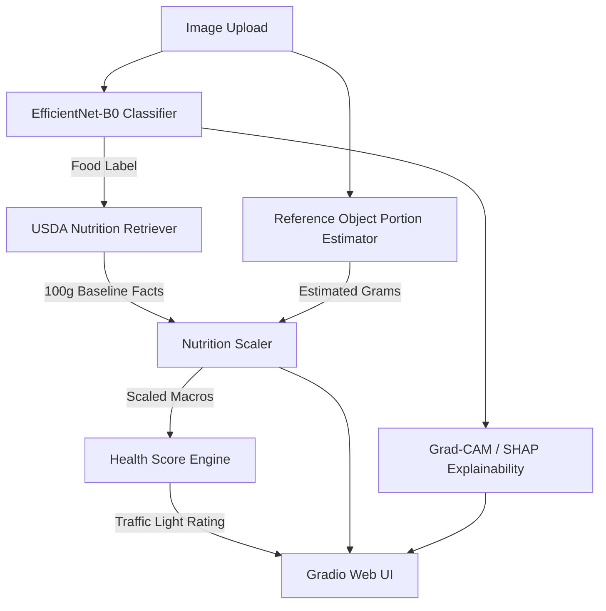
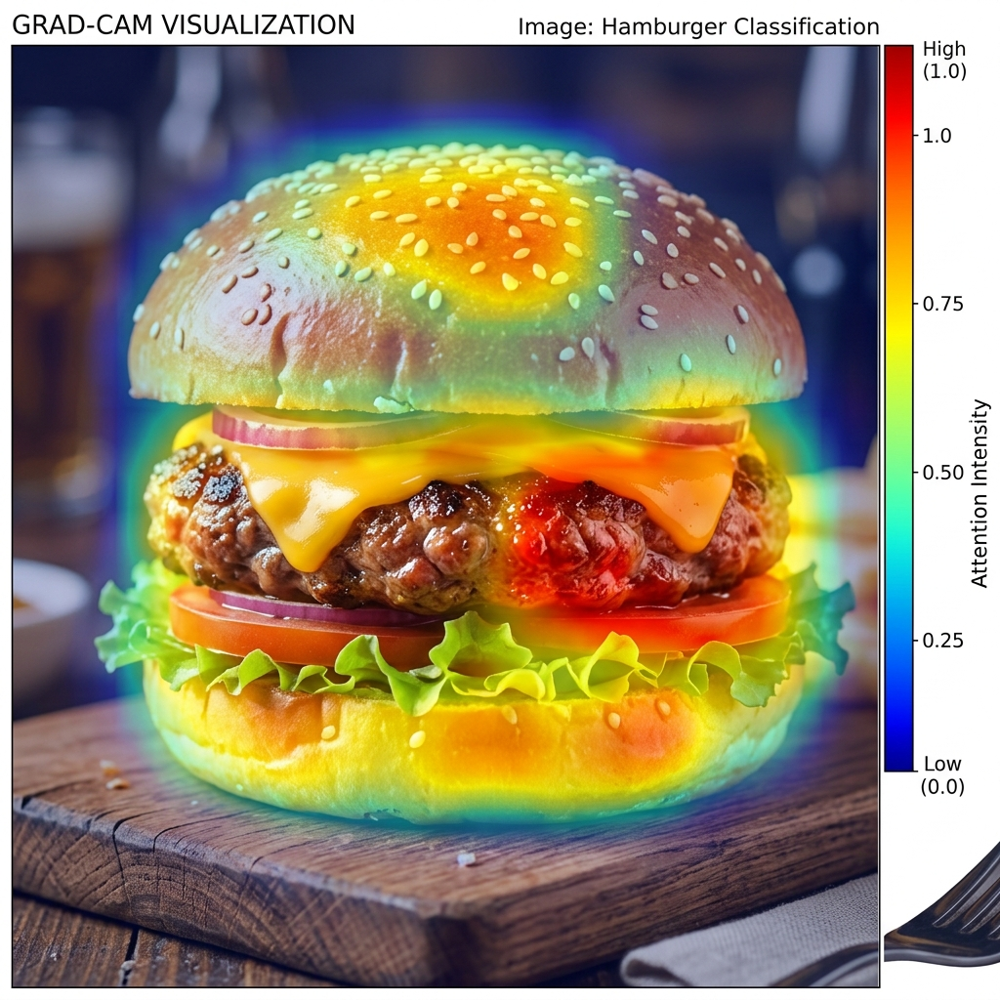

# Food Nutrition Estimator

## Problem Statement
Estimating the nutritional content of a meal from just a photo is challenging but essential for health-conscious users. This project builds an end-to-end multimodal Machine Learning system that takes an image of a meal, classifies the food, estimates the portion size, retrieves its nutritional facts from the USDA FoodData Central, and computes an overall health score.

## Motivation
Tracking daily food intake is crucial for maintaining a healthy diet. However, manual logging is tedious. This system aims to simplify the process by allowing users to simply take a picture of their food to instantly get caloric and macronutrient estimates along with a health rating. Let the AI handle the data entry.

## Pipeline Overview
1. **Food Classification**: A user uploads an image of their meal. An EfficientNet-B0 model (trained on Food-101) classifies the food item.
2. **Nutrition Retrieval**: The predicted label is mapped to an entry in the USDA FoodData Central database to retrieve its baseline nutritional facts (calories, protein, carbs, fat, etc., per 100g).
3. **Portion Estimation**: A regression head on the visual features estimates the portion size (in grams) based on reference scaling.
4. **Health Score Engine**: A rule-based engine scores the meal out of 100 and assigns a traffic-light label (Green/Yellow/Red).
5. **Explainability**: SHAP and Grad-CAM visualize what drove the prediction and score.
6. **UI**: All of this is neatly bundled into a Gradio Web Application.

## Tech Stack
- **Language**: Python 3.10+
- **Deep Learning**: PyTorch, TorchVision (EfficientNet-B0 transfer learning)
- **Data Handling**: Pandas, NumPy, Scikit-learn
- **Computer Vision**: OpenCV
- **Experiment Tracking**: MLflow
- **Explainability**: pytorch-grad-cam, SHAP
- **Web App**: Gradio

## Setup Instructions
1. Clone this repository.
2. Ensure you have Python 3.10+ installed.
3. Create a python virtual environment:
   ```bash
   python -m venv venv
   source venv/bin/activate  # On Windows: venv\Scripts\activate
   ```
4. Install the requirements:
   ```bash
   pip install -r requirements.txt
   ```

## System Architecture



## Explainability
The platform uses techniques like Grad-CAM to ensure the model focuses on the right features.




